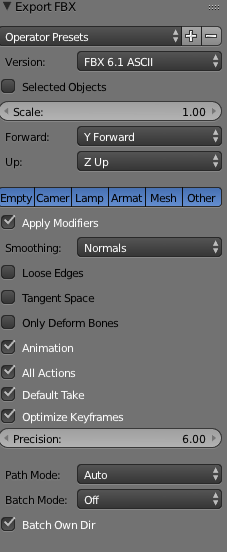

#Instruktioner för animering

###Allmänt: 
Var noga med att exportera enligt instruktionerna. 
Under varje steg i monteringen sker en sak i taget.
Delarna monteras enligt anvisningarna i manualen sett utifrån en vinkel som visar alla nödvändiga delar (vilken del som ska monteras, vilket hål skruv/plugg ska monteras i etc).
Alla rotationer, translationer och övriga operationer i animeringen ska fylla ett funktionellt syfte - alltså undviks t.ex. rotationer som är till för att animeringen ska se "häftig" ut. 

#####Steg 1: 
Ryggstöd monteras i brädan
Vänster plugg monteras
Höger plugg monteras

#####Steg 2:
Tidigare modell monteras på sitsen. Se manual för orientering.

#####Steg 3:
Tidigare modell monteras på ena sidsektionen. Stolen "ligger på marken". Viktigt att alla hål syns i detta steg. 

#####Steg 4: 
Den andra sidsektionen monteras på tidigare modell. Stolen "ligger på marken" på samma sätt som i steg 3.

#####Steg 5:
Skruvar monteras en i taget på tidigare modell. Stolen "ligger på marken".

#####Steg 6:
Stolen har flippats över (obs. detta animeras inte). Det enda som animeras i detta steg är att skruvarna monteras en i taget.